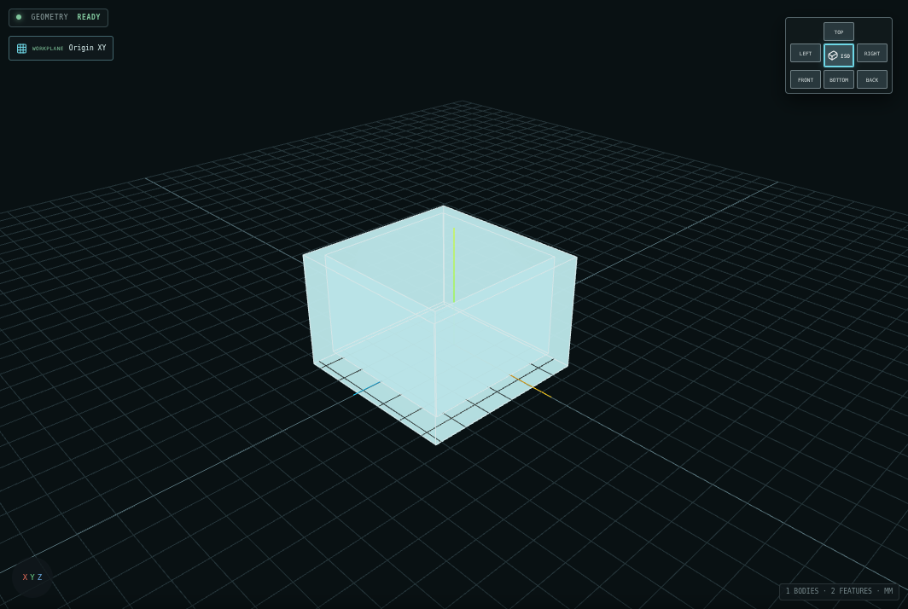

<div align="center">

# BENCHCAD

**Local-first browser CAD with approachable solid modeling, exact dimensions, and an editable construction history.**


</div>


BENCHCAD is a lightweight three-dimensional Computer-Aided Design workbench built for makers, students, educators, fabricators, hobbyists, and engineers. It combines a direct shape-based workflow with a persistent feature timeline: every meaningful modeling operation can be inspected, edited, suppressed, or revisited without reducing the project to an opaque final mesh.

The application runs entirely in the browser. It requires no account, backend, cloud database, subscription, telemetry service, or analytics system. Projects remain on the device unless the user explicitly exports a file.

> [!IMPORTANT]
> BENCHCAD is a pre-1.0, mesh-based CAD system. It is not yet a replacement for a professional boundary-representation mechanical CAD package. Independently verify geometry, tolerances, drawings, and manufacturing decisions before fabrication.

## Current release

| Item | Value |
|---|---|
| Application | **BENCHCAD v0.36.1** |
| Project schema | **9** |
| Drawing schema | **5** |
| Release stage | Active pre-1.0 development |
| Distribution | Prebuilt static web application |
| Runtime services | None required |
| Tested runtime | Chromium with the packaged Three.js viewport and Manifold WebAssembly kernel |
| Additional browser qualification | Firefox and Safari/WebKit scheduled for public-beta hardening |
| Complete package checksum | See `BENCHCAD-v0.36.1-complete.zip.sha256` distributed beside the ZIP |

## What BENCHCAD does

### Modeling

- Creates practical models from boxes, cylinders, spheres, cones, toruses, wedges, pyramids, rounded boxes, tubes, polygonal prisms, text, and profile sketches.
- Supports exact position, rotation, scale, and dimension entry.
- Provides move, rotate, scale, duplicate, mirror, align, distribute, and pattern operations.
- Treats geometry as **solid** or **hole** and supports union, subtraction, and intersection.
- Includes shell, split-body, extrusion, revolve, thin-extrude, rib/web, and thread-metadata workflows.
- Uses the Manifold WebAssembly geometry kernel for exact-solid reconstruction where supported.

### Viewport rendering and inspection

- Uses **Shaded + edges** by default so silhouettes, shell lips, bores, pockets, and internal wall intersections remain readable.
- Offers **Shaded**, **Technical**, **X-ray inspect**, and **Wireframe** display styles from the eye menu in the viewport toolbar.
- Uses physically based materials, ACES tone mapping, balanced key/fill/rim lighting, and contact shadows for stronger depth cues without changing model geometry.
- Draws geometry-derived feature edges rather than decorative screen-space outlines. Edge extraction is capped for very dense unselected meshes so a display preference cannot freeze the workspace.
- Gives selected bodies a distinct cyan outline and makes hidden feature edges visible in X-ray mode.
- Stores the chosen viewport style as a browser-local interface preference; it is not written into or allowed to alter the project model.



### Editable construction history

- Records meaningful modeling actions as persistent timeline features.
- Allows rollback to an earlier point without deleting later work.
- Rebuilds valid downstream features after earlier parameters change.
- Preserves stable project, feature, body, component, and drawing identifiers.
- Supports suppression, checkpoints, branch-safe edits, and explicit dependency failures.
- Keeps command undo/redo separate from the authoritative feature timeline.

### Parameters and organization

- Provides project-level named parameters and arithmetic expressions.
- Supports millimeter, centimeter, inch, meter, degree, and radian literals.
- Detects unknown references, cycles, division by zero, and invalid results.
- Organizes bodies through component definitions, occurrences, visibility controls, and basic joint records.
- Includes a synchronized Component Browser, Inspector, viewport selection, and feature timeline.

### Manufacturing preparation

- Screens visible or selected bodies for mesh integrity and common manufacturing concerns.
- Includes FDM printing, resin printing, CNC machining, molding/casting, and generic mesh-export presets.
- Reports open/non-manifold geometry, winding problems, zero-volume bodies, thin regions, small features, overhangs, draft, and possible interference.
- Exports local manufacturing reports as JSON or printable HTML.
- Integrates serious findings into STL, OBJ, and 3MF export preflight.

These checks are design aids, not manufacturing certification.

### Technical Drawings 2.0


- Creates multiple drawing sheets with editable title blocks.
- Generates front, back, top, bottom, left, right, and isometric views from exact reconstructed meshes.
- Uses depth-aware visible/hidden line splitting, including occlusion between bodies.
- Supports first-angle and third-angle projected-view placement.
- Creates clipped, axis-aligned full sections with material-region hatching.
- Supports overall, horizontal, vertical, aligned, angular, and ordinate dimensions.
- Supports diameter/radius leaders, center marks, centerlines, hole callouts, and thread callouts when trustworthy source metadata exists.
- Creates parent-linked circular or rectangular Detail views with independent scales.
- Preserves associative projected-entity references and provides reviewed broken-reference repair.
- Reports printable-area, title-block, view, note, and annotation collisions.
- Exports drawing sheets as SVG, ASCII DXF, and PDF.

Drawing export fails closed when required geometry or references cannot be resolved. Layout warnings remain reviewable because some overlaps can be intentional.

## Quick start

The release is already built. Node.js, `npm`, and a compilation step are not required.

### 1. Extract the release

Keep these items together at the deployment root:

```text
index.html
sw.js
manifest.webmanifest
assets/
```

Do not place the extracted folder itself inside the target directory unless the extra path level is intentional. Copy the **contents** of the archive into the directory that should serve BENCHCAD.

### 2. Serve it over HTTP or HTTPS

From the extracted directory:

```bash
python3 -m http.server 8080
```

Open:

```text
http://localhost:8080/
```

BENCHCAD can also be hosted by Apache, Nginx, GitHub Pages, Cloudflare Pages, Netlify, ordinary shared hosting, or any other static file server.

> [!NOTE]
> Opening `index.html` directly with a `file:` URL is not the supported path. Web Workers, WebAssembly, IndexedDB, and service workers are most reliable over HTTPS or `localhost`.

## Static deployment

All application-shell paths are relative. The same build can be hosted at a domain root:

```text
https://example.com/
```

or inside a subdirectory:

```text
https://example.com/projects/benchcad/
```

A Green Shoe Garage deployment can place the extracted files directly in the directory mapped to:

```text
https://greenshoegarage.com/projects/benchcad/
```

No backend routes or database are required. A static host should serve the WebAssembly file with an appropriate WebAssembly MIME type; most current hosting platforms do this automatically.

After replacing an existing deployment, perform a hard refresh. When an older build remains cached, remove the previous BENCHCAD service worker/site cache once and reload while online.

## First model walkthrough

1. Open BENCHCAD and choose **Fresh Start**.
2. Insert a **Box** and enter exact width, depth, and height values in the Inspector.
3. Insert a **Cylinder**, set it to **Hole**, and position it through the plate.
4. Select both bodies and use the alignment controls.
5. Use **Combine → Subtract** to cut the hole.
6. Move the feature-history marker backward to the cylinder creation feature.
7. Edit the cylinder diameter.
8. Return the marker to the end and review the rebuilt result.
9. Export a `.benchcad` backup before exporting STL, OBJ, or 3MF for downstream use.

This workflow demonstrates the defining BENCHCAD behavior: the model is not just a final mesh; it is a reconstructable sequence of editable design decisions.

## Main workspaces

| Workspace | Purpose |
|---|---|
| **Model** | Shape placement, sketching, direct manipulation, Booleans, components, parameters, manufacturing checks, and feature history |
| **Drawing** | Associative views, sections, Detail views, dimensions, callouts, title blocks, release checks, and document export |
| **Maker Mode** | Default, lower-friction interface focused on common modeling tasks |
| **Advanced Mode** | Dependency details, identifiers, diagnostics, import repair controls, and deeper project information |
| **Canvas Focus** | Temporarily hides surrounding panels so the model or drawing receives maximum space |

Press `Shift+F` to toggle Canvas Focus. Press `Escape` to leave it.

## Import and export

### Import

| Format | Use | Notes |
|---|---|---|
| `.benchcad` | Complete BENCHCAD project | Validates archive structure and SHA-256 integrity when present |
| `.stl` | Triangle mesh | Unitless; BENCHCAD asks how to interpret source coordinates |
| `.obj` | Triangle mesh | Unitless; BENCHCAD asks how to interpret source coordinates |
| `.3mf` | Triangle mesh | Units are read from the model when available |
| `.dxf` | Editable sketch | ASCII DXF support for `LINE`, `POLYLINE`, `LWPOLYLINE`, `CIRCLE`, `ARC`, and `POINT` |
| `.benchcad-recovery` | Local project-library recovery backup | Restores validated project records to browser storage |

Mesh import includes an integrity review before anything is committed to the feature timeline. Optional repairs begin disabled and must be selected explicitly.

### Export

| Format | Use |
|---|---|
| `.benchcad` | Complete, versioned project archive with SHA-256 file integrity records |
| `.benchcad-recovery` | Recovery backup containing locally stored BENCHCAD projects |
| STL | Three-dimensional printing and general mesh interchange |
| OBJ | General mesh interchange |
| 3MF | Unit-aware additive-manufacturing interchange |
| DXF | Sketch/profile output and technical drawing sheets |
| SVG | Technical drawing sheets |
| PDF | Individual sheets or complete drawing sets |
| JSON / HTML | Manufacturing-readiness reports |
| JSON | Private browser diagnostics with no project names, geometry, history, or filenames |

### Why there is no STEP export

BENCHCAD currently reconstructs manifold triangle meshes. Trustworthy STEP output requires analytic boundary-representation faces, edges, solids, and persistent topology naming. BENCHCAD deliberately does not wrap tessellated triangles in a STEP-like container and claim reliable solid interoperability.

## Feature timeline versus undo

BENCHCAD has two different history systems:

- **Undo/redo** reverses recent commands during the current editing session.
- **Feature history** is part of the saved design and describes how the model is reconstructed.

Editing an earlier feature changes that feature and rebuilds its dependents. It does not append a confusing inverse operation. Moving the history marker only changes the reconstructed point being viewed; later features remain present unless the user explicitly chooses to discard or branch from the hidden future.

## Project archives and recovery

A `.benchcad` project is a ZIP-compatible archive. Current archives can contain:

```text
manifest.json
project.json
components.json
occurrences.json
joints.json
workplanes.json
history.json
checkpoints.json
drawings.json
assets/
README.txt
```

`manifest.json` identifies the format and schema and stores SHA-256 hashes for the archived project files and source assets. BENCHCAD verifies these records before replacing the current project.

Projects are autosaved to IndexedDB, but browser storage is not a durable backup. Site-data clearing, private browsing, storage pressure, browser cleanup, or operating-system cleanup can remove local records. Export `.benchcad` files regularly and create a `.benchcad-recovery` backup before major browser or operating-system changes.

## Keyboard shortcuts

Shortcuts are ignored while a text, number, or other editable field has focus.

| Shortcut | Action |
|---|---|
| `Ctrl/Cmd + N` | Confirm and create a new project |
| `Ctrl/Cmd + S` | Export the current `.benchcad` project |
| `Ctrl/Cmd + Z` | Undo |
| `Ctrl/Cmd + Shift + Z` | Redo |
| `Ctrl/Cmd + D` | Duplicate selection |
| `Delete` / `Backspace` | Delete selection |
| `V` | Body-selection mode |
| `B` | Toggle box selection |
| `M` | Move selected geometry |
| `R` | Rotate selected geometry |
| `S` | Scale selected geometry |
| Arrow keys | Nudge selection by the current translation increment |
| `Shift` + Arrow keys | Nudge by ten times the current increment |
| `Home` | Move the history marker to the beginning |
| `End` | Move the history marker to the end |
| `Alt + Left` / `Alt + Right` | Step the history marker backward/forward |
| `Space` | Play or pause feature-history playback |
| `/` | Focus Shape Library search |
| `Shift + F` | Toggle Canvas Focus |
| `Escape` | Cancel the active transform/tool or leave Canvas Focus |

## Privacy and offline behavior

BENCHCAD itself does not upload project geometry, filenames, previews, drawings, or usage analytics. Its browser diagnostics export explicitly excludes project names, geometry, history, filenames, and captured content.

The service worker precaches the application shell, including:

- `index.html`
- application JavaScript and CSS
- geometry and import workers
- the Manifold WebAssembly kernel
- the web manifest and icons

After one successful hosted load, the application can reopen from cache. The web server or hosting provider may still maintain ordinary HTTP access logs; that is separate from BENCHCAD application telemetry.

## Browser support

The v0.36.1 production workflow was exercised in Chromium with the actual Three.js renderer, geometry worker, import worker, and packaged Manifold WebAssembly kernel.

Firefox and Safari/WebKit are design targets, but real-runtime qualification was not available in the v0.36.1 release environment and remains scheduled for the public-beta hardening stage. Report browser-specific behavior with the exact browser version and operating system.

## Release validation

The v0.36.1 package includes machine-readable validation evidence:

| Report | Coverage |
|---|---|
| `VIEWPORT-RENDERING-TESTS.json` | Five viewport styles, shelled-body reconstruction, distinct rendered frames, responsive controls, and console cleanliness |
| `V0.36.1-PACKAGE-TESTS.json` | Current release identity, schemas, syntax, service-worker coverage, screenshots, nested hosting, and runtime assets |
| `UIUX-CONSOLIDATION-TESTS.json` | Responsive layout, command consolidation, drawers, Canvas Focus, and interaction checks |
| `ACTUAL-WORKER-TESTS.json` | Production bundle, Three.js viewport, geometry worker, and Manifold WebAssembly checks |
| `V0.36.0-DRAWING-REGRESSION.json` | Technical Drawings 2.0 regression and cross-format primitive parity |
| `STATIC-PACKAGE-TESTS.json` | Retained v0.36.0 static-shell, relative-path, schema, syntax, service-worker, and asset checks |
| `BATCH28D-TESTS.json` | Retained Detail-view and drawing-output qualification |
| `SHA256SUMS.txt` | Release-file checksums |

Release summary:

- **30/30** viewport-rendering and shell-inspection checks passed.
- **72/72** current v0.36.1 package and nested-hosting checks passed.
- **33/33** responsive UI/UX checks passed.
- **7/7** production worker/WebAssembly checks passed.
- **28/28** retained drawing-browser regressions passed.
- **28/28** static-package checks passed before final archive verification.
- SVG, DXF, and PDF received the same deterministic drawing primitive signature in the qualification fixture.

See `RELEASE-NOTES.md` for the release history and `KNOWN-LIMITATIONS.md` for the complete current limitation set.

## Repository layout

This complete v0.36.1 static distribution and GitHub documentation package is organized as follows:

```text
.
├── index.html
├── sw.js
├── manifest.webmanifest
├── favicon.svg
├── assets/
│   ├── benchcad-v0.36.1.js
│   ├── benchcad-v0.36.1.css
│   ├── geometry.worker-*.js
│   ├── import.worker-*.js
│   └── manifold-*.wasm
├── README.md
├── RELEASE-README.md
├── docs/
│   └── images/
│       ├── benchcad-model-workspace.png
│       ├── benchcad-drawing-workspace.png
│       ├── benchcad-viewport-shaded-edges.png
│       └── benchcad-viewport-xray.png
├── RELEASE-NOTES.md
├── KNOWN-LIMITATIONS.md
├── VERSION.txt
├── SHA256SUMS.txt
└── *-TESTS.json / *-TESTS.txt
```

The hashed bundle filenames are release artifacts and may change between builds. `index.html` and `sw.js` are the authoritative references for the files used by a particular release.

## Development note

This repository package is the **prebuilt static distribution**, not a complete TypeScript source checkout. It intentionally requires no Node.js toolchain to run. Do not treat the bundled JavaScript or generated source maps as the primary development source.

The implementation was built around TypeScript, React, Vite, Three.js, Manifold, IndexedDB, Web Workers, and a Service Worker. When the full source tree is published, source-specific installation, test, and build commands should live in a separate `DEVELOPMENT.md` and be derived from the actual package scripts rather than guessed from the static bundle.

## Known limitations

The most important current limits are:

- Mesh topology is not analytic boundary-representation topology.
- Large upstream topology changes can require reviewed drawing-reference reattachment.
- Circle recognition is deliberately conservative and does not expose every partial arc.
- Imported mesh holes do not automatically gain drilled, counterbored, countersunk, tapped, or threaded design intent.
- Full geometric dimensioning and tolerancing, datum systems, baseline/chain dimension systems, and inspection balloons are not implemented.
- Sections are currently global-axis full sections; offset, aligned, revolved, and broken-out sections are not implemented.
- Drawing layout diagnostics report conflicts but do not automatically arrange a sheet.
- Large or very dense models and drawings can become computationally expensive.
- No STEP export, finite-element analysis, computational fluid dynamics, or manufacturing toolpath generation is provided.
- There is no cloud collaboration or multi-user editing.
- Firefox and Safari/WebKit still require real-device public-beta qualification.

Read `KNOWN-LIMITATIONS.md` before using BENCHCAD output for fabrication.

## Roadmap

| Batch | Focus | Status |
|---|---|---|
| 28 | Technical Drawings 2.0 | Complete |
| 29 | Large-model performance: incremental rebuilds, caching, selective work, level of detail, cancellation, and memory diagnostics | Next |
| 30 | Public-beta hardening: recovery, storage failures, migrations, cross-browser, accessibility, mobile/tablet, offline, and import abuse cases | Planned |
| 31 | v1.0 release candidate: reference projects, downstream validation, deterministic reconstruction, documentation, licensing, and packaging | Planned |

## Reporting a problem

A useful issue report includes:

1. BENCHCAD version, project schema, browser version, and operating system.
2. Exact steps that reproduce the behavior.
3. What was expected and what happened instead.
4. Whether the problem persists after a hard refresh with extensions disabled.
5. The private browser-diagnostics JSON from **Recovery & Storage Health**, when relevant.
6. A minimal `.benchcad` project only when it contains no geometry or information you consider sensitive.

Do not post proprietary or confidential model files in a public issue. BENCHCAD diagnostics are designed to omit project content; project archives are not.

## Project principles

Changes to BENCHCAD should preserve these constraints:

- Local-first and private by default.
- No required account, backend, cloud service, telemetry, analytics, or advertising.
- Static deployment at a domain root or arbitrary subdirectory.
- Feature history remains the authoritative source of design intent.
- Destructive history changes require explicit confirmation.
- Failed reconstruction preserves the last valid model and exposes the failure.
- Import repair and drawing-reference repair are explicit, reviewable actions.
- Maker Mode remains approachable without weakening the underlying project.

## License

The v0.36.1 static package does **not** include a project-level `LICENSE` file. Public availability of the repository does not by itself grant permission to copy, modify, or redistribute BENCHCAD. Add an explicit project license before treating the project as open source or accepting code contributions.

Bundled third-party software remains subject to its respective licenses and notices. Major technologies represented in the distribution include React, Three.js, Manifold, Lucide, Radix UI, JSZip, and related supporting packages. A formal public release should include a reviewed `THIRD_PARTY_NOTICES.md` generated from the actual dependency manifest.

---

<div align="center">

**BENCHCAD: friendly shape-based modeling with a transparent, editable construction history.**

</div>
