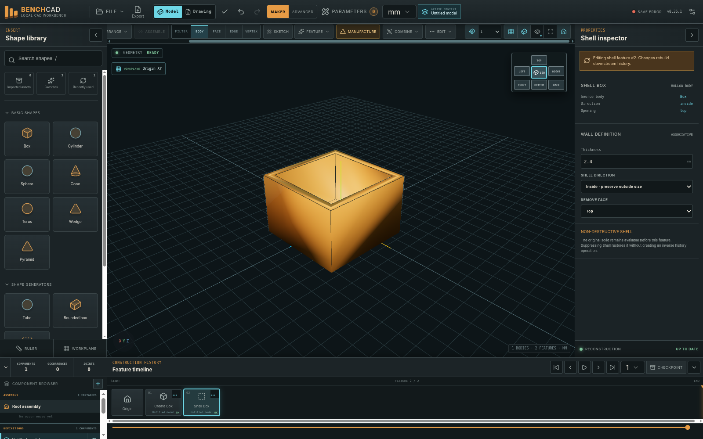
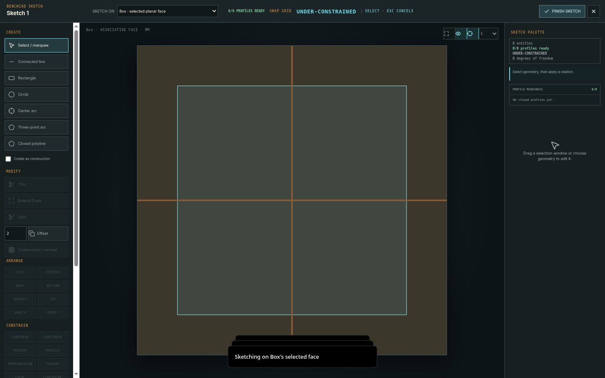
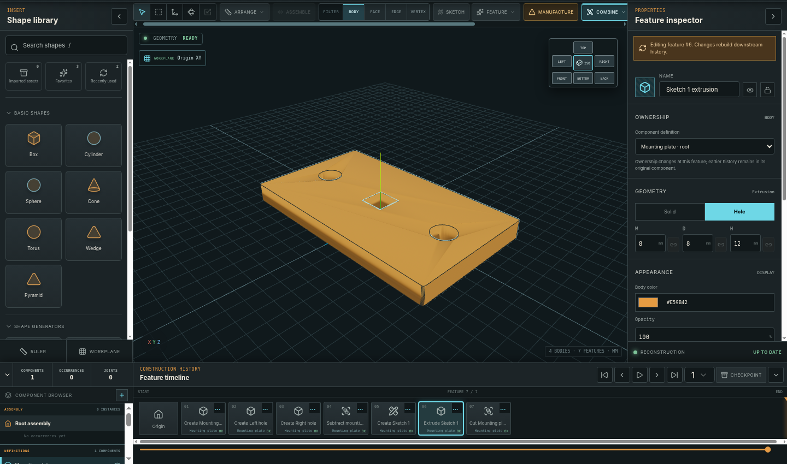
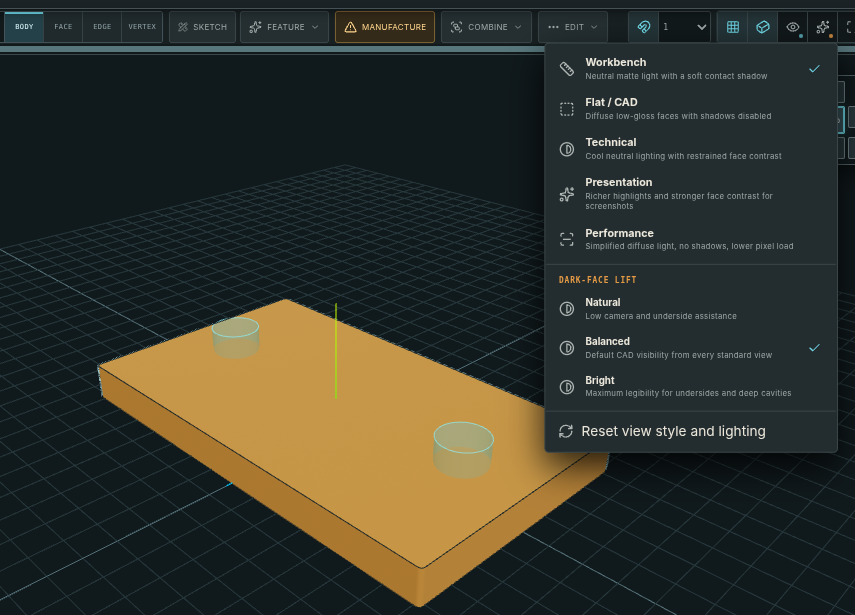
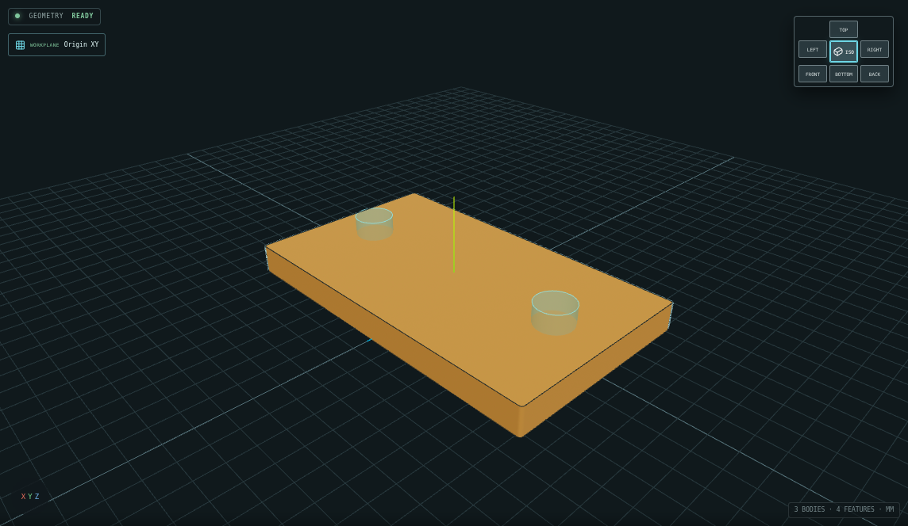
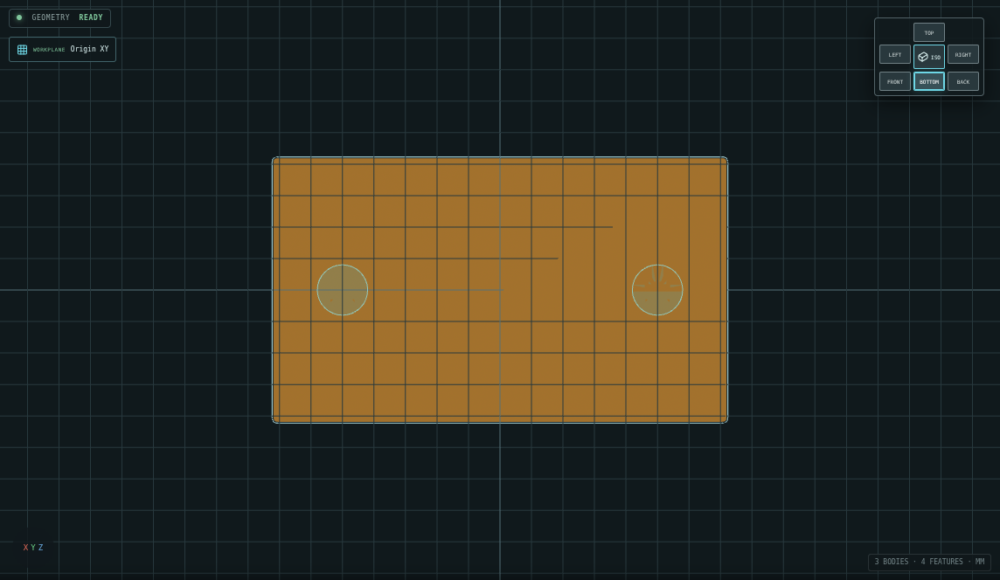
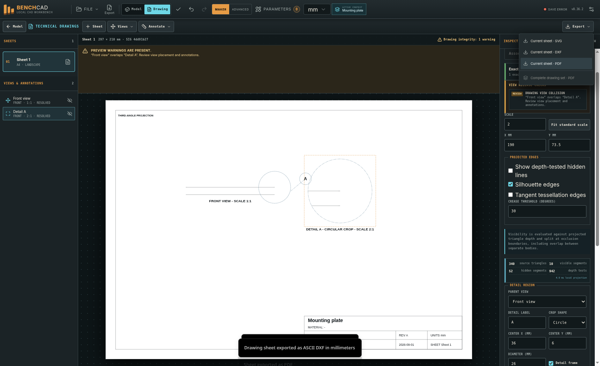

<div align="center">

# BENCHCAD

**Local-first browser CAD with persistent face/workplane sketches, bidirectional extrusion, exact dimensions, and an editable construction history.**


</div>



BENCHCAD is a lightweight three-dimensional Computer-Aided Design workbench built for makers, students, educators, fabricators, hobbyists, and engineers. It combines a direct shape-based workflow with a persistent feature timeline: every meaningful modeling operation can be inspected, edited, suppressed, or revisited without reducing the project to an opaque final mesh.

The application runs entirely in the browser. It requires no account, backend, cloud database, subscription, telemetry service, or analytics system. Projects remain on the device unless the user explicitly exports a file.

> [!IMPORTANT]
> BENCHCAD is a pre-1.0, mesh-based CAD system. It is not yet a replacement for a professional boundary-representation mechanical CAD package. Independently verify geometry, tolerances, drawings, and manufacturing decisions before fabrication.

## Current release

| Item | Value |
|---|---|
| Application | **BENCHCAD v0.37.0** |
| Project schema | **10** |
| Drawing schema | **5** |
| Release stage | Active pre-1.0 development |
| Distribution | Prebuilt static web application |
| Runtime services | None required |
| Tested runtime | Headed Chromium workflow testing plus a separate run using the production geometry worker and the exact packaged Manifold WebAssembly kernel |
| Additional browser qualification | Firefox and Safari/WebKit scheduled for public-beta hardening |
| Complete package checksum | See `BENCHCAD-v0.37.0-complete.zip.sha256` distributed beside the ZIP |

## What BENCHCAD does

### Modeling

- Creates practical models from boxes, cylinders, spheres, cones, toruses, wedges, pyramids, rounded boxes, tubes, polygonal prisms, text, and profile sketches.
- Supports exact position, rotation, scale, and dimension entry.
- Provides move, rotate, scale, duplicate, mirror, align, distribute, and pattern operations.
- Treats geometry as **solid** or **hole** and supports union, subtraction, and intersection.
- Includes shell, split-body, extrusion, revolve, thin-extrude, rib/web, and thread-metadata workflows.
- Uses the Manifold WebAssembly geometry kernel for exact-solid reconstruction where supported.

### First-class 2D sketching

- Starts sketches on an origin plane, an associative workplane, or a selected planar body face.
- Shows the exact reconstructed supporting body and selected face beneath the sketch canvas. When exact geometry is unavailable, any envelope fallback is explicitly labeled and is never treated as authoritative solid geometry.
- Opens every new sketch in **Select** mode; a line chain begins only after the Line or Polyline command is chosen and the first point is clicked.
- Uses **Escape** to cancel the active command or unfinished chain and return to Select. A second Escape in Select clears the current sketch selection. **Enter** completes an open line/polyline chain. **Finish sketch** also preserves a valid two-point-or-longer pending connected-line chain as an open polyline instead of silently dropping it.
- Keeps a finished sketch as a persistent timeline feature, Component Browser item, and optional three-dimensional overlay instead of making it disappear.
- Reopens a sketch by double-clicking its Component Browser row or by using **Edit sketch** in the Inspector.
- Provides **Extrude profiles** in the Inspector to reopen the sketch with valid closed profiles selected.
- Extrudes **Positive**, **Negative**, or **Symmetric** relative to the sketch normal.
- Creates a **New body**, **Joins** the target body, or **Cuts** the target body. A face-supported sketch defaults Join/Cut to its supporting body when appropriate.
- Preserves the source sketch after extrusion so later profile edits can rebuild downstream features.





### Viewport rendering and inspection

BENCHCAD separates **how geometry is drawn** from **how it is lit**. This keeps the useful cavity and edge tools independent from the amount of shading, gloss, and pixel load.

**Display styles** are selected from the eye menu:

- **Shaded + edges** — default geometry presentation with silhouette, crease, and shell-cavity traces.
- **Shaded** — surfaces without feature-edge overlays.
- **Technical** — neutralized body color with high-contrast engineering linework.
- **Interior inspect** — ghosted exterior surfaces and emphasized concave cavity traces.
- **X-ray inspect** — translucent surfaces with through-body feature edges.
- **Wireframe** — tessellated triangle-mesh inspection.

**Lighting presets** are selected from the adjacent sparkles menu:

- **Workbench** — the modeling-first default: neutral matte faces, restrained highlights, a soft contact shadow, and dedicated camera/underside assistance so standard views remain readable.
- **Flat / CAD** — diffuse Lambert shading with no real-time cast shadows or specular gloss, plus the strongest neutral all-angle illumination for face selection and long modeling sessions.
- **Technical** — cool neutral lighting with low surface drama, balanced lower-hemisphere fill, and dominant engineering linework.
- **Presentation** — warmer key/rim balance, richer highlights, and stronger face contrast for screenshots without returning to the heavy clearcoat look.
- **Performance** — simplified diffuse all-angle lighting, no shadows, and a renderer pixel-ratio cap of 1.25 for dense scenes and lower-power hardware.

A third control in the sparkles menu sets **Dark-face lift** independently from the preset:

- **Natural** — low camera and underside assistance; retains more directional falloff.
- **Balanced** — default CAD visibility from every standard view.
- **Bright** — maximum legibility for undersides, recessed faces, and deep cavities.

Display style, lighting preset, and dark-face lift are independent, so combinations such as **Shaded + edges + Flat / CAD + Bright** or **Interior inspect + Workbench + Balanced** are supported. **Shift+L** cycles lighting presets without changing the lift level. **Reset view style and lighting** returns all three layers to Shaded + edges, Workbench, and Balanced.

The selected display style, lighting preset, and lift level are stored as browser-local interface preferences. None creates a timeline feature, dirties the project, changes authoritative geometry, or affects STL/OBJ/3MF/drawing exports.

Edge safeguards remain in place: ordinary feature-edge extraction is skipped for dense unselected bodies above 180,000 triangles, shell-cavity extraction is skipped above 220,000 triangles, and a maximum of 6,000 cavity-edge segments is displayed.





The retained v0.36.4 Bottom-view fixture demonstrates the effect of the Balanced default. Median body-region luminance increased from **22.89** in v0.36.3 to **118.51** in v0.36.4 Balanced; Natural and Bright remain available for less or more lift.



**Interior inspect, lighting presets, and dark-face lift are display aids.** They are not true sections, wall-thickness analyses, ambient-occlusion measurements, calibrated photometry, or manufacturing results.

### Editable construction history

- Records meaningful modeling actions as persistent timeline features.
- Allows rollback to an earlier point without deleting later work.
- Rebuilds valid downstream features after earlier parameters change.
- Preserves stable project, feature, body, component, and drawing identifiers.
- Supports suppression, checkpoints, branch-safe edits, and explicit dependency failures.
- Keeps command undo/redo separate from the authoritative feature timeline.

### Parameters and organization

- Provides project-level named parameters and arithmetic expressions.
- Supports millimeter, centimeter, inch, meter, degree, and radian literals.
- Detects unknown references, cycles, division by zero, and invalid results.
- Organizes bodies through component definitions, occurrences, visibility controls, and basic joint records.
- Includes a synchronized Component Browser, Inspector, viewport selection, and feature timeline.

### Manufacturing preparation

- Screens visible or selected bodies for mesh integrity and common manufacturing concerns.
- Includes FDM printing, resin printing, CNC machining, molding/casting, and generic mesh-export presets.
- Reports open/non-manifold geometry, winding problems, zero-volume bodies, thin regions, small features, overhangs, draft, and possible interference.
- Exports local manufacturing reports as JSON or printable HTML.
- Integrates serious findings into STL, OBJ, and 3MF export preflight.

These checks are design aids, not manufacturing certification.

### Technical Drawings 2.0



- Creates multiple drawing sheets with editable title blocks.
- Generates front, back, top, bottom, left, right, and isometric views from exact reconstructed meshes.
- Uses depth-aware visible/hidden line splitting, including occlusion between bodies.
- Supports first-angle and third-angle projected-view placement.
- Creates clipped, axis-aligned full sections with material-region hatching.
- Supports overall, horizontal, vertical, aligned, angular, and ordinate dimensions.
- Supports diameter/radius leaders, center marks, centerlines, hole callouts, and thread callouts when trustworthy source metadata exists.
- Creates parent-linked circular or rectangular Detail views with independent scales.
- Preserves associative projected-entity references and provides reviewed broken-reference repair.
- Reports printable-area, title-block, view, note, and annotation collisions.
- Exports drawing sheets as SVG, ASCII DXF, and PDF.

Drawing export fails closed when required geometry or references cannot be resolved. Layout warnings remain reviewable because some overlaps can be intentional.

## Quick start

The release is already built. Node.js, `npm`, and a compilation step are not required.

### 1. Extract the release

Keep these items together at the deployment root:

```text
index.html
sw.js
manifest.webmanifest
assets/
```

Do not place the extracted folder itself inside the target directory unless the extra path level is intentional. Copy the **contents** of the archive into the directory that should serve BENCHCAD.

### 2. Serve it over HTTP or HTTPS

From the extracted directory:

```bash
python3 -m http.server 8080
```

Open:

```text
http://localhost:8080/
```

BENCHCAD can also be hosted by Apache, Nginx, GitHub Pages, Cloudflare Pages, Netlify, ordinary shared hosting, or any other static file server.

> [!NOTE]
> Opening `index.html` directly with a `file:` URL is not the supported path. Web Workers, WebAssembly, IndexedDB, and service workers are most reliable over HTTPS or `localhost`.

## Static deployment

All application-shell paths are relative. The same build can be hosted at a domain root:

```text
https://example.com/
```

or inside a subdirectory:

```text
https://example.com/projects/benchcad/
```

A Green Shoe Garage deployment can place the extracted files directly in the directory mapped to:

```text
https://greenshoegarage.com/projects/benchcad/
```

No backend routes or database are required. A static host should serve the WebAssembly file with an appropriate WebAssembly MIME type; most current hosting platforms do this automatically.

After replacing an existing deployment, perform a hard refresh. When an older build remains cached, remove the previous BENCHCAD service worker/site cache once and reload while online.

## First model walkthrough

1. Open BENCHCAD and choose **Fresh Start**.
2. Insert a **Box** and enter exact width, depth, and height values in the Inspector.
3. Select a planar face on the box and choose **Sketch**. The body remains visible beneath the sketch canvas and the editor starts in Select mode.
4. Choose **Rectangle**, draw a closed profile, then choose **Negative** and **Cut target body** to cut into the supporting face.
5. Finish the operation and confirm that the source sketch remains visible in the Component Browser and three-dimensional viewport.
6. Double-click the sketch row, edit the profile, and finish the sketch. BENCHCAD rebuilds the dependent cut.
7. Move the feature-history marker backward, inspect an earlier state, then return it to the end.
8. Export a `.benchcad` backup before exporting STL, OBJ, or 3MF for downstream use.

This workflow demonstrates the defining BENCHCAD behavior: sketches, solid features, and downstream results remain reconstructable design decisions rather than collapsing into an opaque final mesh.

## Main workspaces

| Workspace | Purpose |
|---|---|
| **Model** | Shape placement, sketching, direct manipulation, Booleans, components, parameters, manufacturing checks, and feature history |
| **Drawing** | Associative views, sections, Detail views, dimensions, callouts, title blocks, release checks, and document export |
| **Maker Mode** | Default, lower-friction interface focused on common modeling tasks |
| **Advanced Mode** | Dependency details, identifiers, diagnostics, import repair controls, and deeper project information |
| **Canvas Focus** | Temporarily hides surrounding panels so the model or drawing receives maximum space |

Press `Shift+F` to toggle Canvas Focus. Press `Escape` to leave it.

## Import and export

### Import

| Format | Use | Notes |
|---|---|---|
| `.benchcad` | Complete BENCHCAD project | Validates archive structure and SHA-256 integrity when present |
| `.stl` | Triangle mesh | Unitless; BENCHCAD asks how to interpret source coordinates |
| `.obj` | Triangle mesh | Unitless; BENCHCAD asks how to interpret source coordinates |
| `.3mf` | Triangle mesh | Units are read from the model when available |
| `.dxf` | Editable sketch | ASCII DXF support for `LINE`, `POLYLINE`, `LWPOLYLINE`, `CIRCLE`, `ARC`, and `POINT` |
| `.benchcad-recovery` | Local project-library recovery backup | Restores validated project records to browser storage |

Mesh import includes an integrity review before anything is committed to the feature timeline. Optional repairs begin disabled and must be selected explicitly.

### Export

| Format | Use |
|---|---|
| `.benchcad` | Complete, versioned project archive with SHA-256 file integrity records |
| `.benchcad-recovery` | Recovery backup containing locally stored BENCHCAD projects |
| STL | Three-dimensional printing and general mesh interchange |
| OBJ | General mesh interchange |
| 3MF | Unit-aware additive-manufacturing interchange |
| DXF | Sketch/profile output and technical drawing sheets |
| SVG | Technical drawing sheets |
| PDF | Individual sheets or complete drawing sets |
| JSON / HTML | Manufacturing-readiness reports |
| JSON | Private browser diagnostics with no project names, geometry, history, or filenames |

### Why there is no STEP export

BENCHCAD currently reconstructs manifold triangle meshes. Trustworthy STEP output requires analytic boundary-representation faces, edges, solids, and persistent topology naming. BENCHCAD deliberately does not wrap tessellated triangles in a STEP-like container and claim reliable solid interoperability.

## Feature timeline versus undo

BENCHCAD has two different history systems:

- **Undo/redo** reverses recent commands during the current editing session.
- **Feature history** is part of the saved design and describes how the model is reconstructed.

Editing an earlier feature changes that feature and rebuilds its dependents. It does not append a confusing inverse operation. Moving the history marker only changes the reconstructed point being viewed; later features remain present unless the user explicitly chooses to discard or branch from the hidden future.

## Project archives and recovery

A `.benchcad` project is a ZIP-compatible archive. Current archives can contain:

```text
manifest.json
project.json
components.json
occurrences.json
joints.json
workplanes.json
history.json
checkpoints.json
drawings.json
assets/
README.txt
```

`manifest.json` identifies the format and schema and stores SHA-256 hashes for the archived project files and source assets. BENCHCAD verifies these records before replacing the current project.

Projects are autosaved to IndexedDB, but browser storage is not a durable backup. Site-data clearing, private browsing, storage pressure, browser cleanup, or operating-system cleanup can remove local records. Export `.benchcad` files regularly and create a `.benchcad-recovery` backup before major browser or operating-system changes.

## Keyboard shortcuts

Global shortcuts are ignored while a text, number, or other editable field has focus. In the Sketch editor, `Escape` is captured intentionally so it can blur the field, cancel the current command, clear transient geometry, and restore Select mode.

| Shortcut | Action |
|---|---|
| `Ctrl/Cmd + N` | Confirm and create a new project |
| `Ctrl/Cmd + S` | Export the current `.benchcad` project |
| `Ctrl/Cmd + Z` | Undo |
| `Ctrl/Cmd + Shift + Z` | Redo |
| `Ctrl/Cmd + D` | Duplicate selection |
| `Delete` / `Backspace` | Delete selection |
| `V` | Body-selection mode |
| `B` | Toggle box selection |
| `M` | Move selected geometry |
| `R` | Rotate selected geometry |
| `S` | Scale selected geometry |
| Arrow keys | Nudge selection by the current translation increment |
| `Shift` + Arrow keys | Nudge by ten times the current increment |
| `Home` | Move the history marker to the beginning |
| `End` | Move the history marker to the end |
| `Alt + Left` / `Alt + Right` | Step the history marker backward/forward |
| `Space` | Play or pause feature-history playback |
| `/` | Focus Shape Library search |
| `Shift + F` | Toggle Canvas Focus |
| `Shift + L` | Cycle Workbench, Flat / CAD, Technical, Presentation, and Performance lighting |
| `Escape` | Cancel the active transform/tool or leave Canvas Focus; in Sketch, cancel the current command/chain and return to Select, then clear selection on a second press |
| `Enter` | In Sketch, complete the current open line or polyline chain |

## Privacy and offline behavior

BENCHCAD itself does not upload project geometry, filenames, previews, drawings, or usage analytics. Its browser diagnostics export explicitly excludes project names, geometry, history, filenames, and captured content.

The service worker precaches the application shell, including:

- `index.html`
- application JavaScript and CSS
- geometry and import workers
- the Manifold WebAssembly kernel
- the web manifest and icons

After one successful hosted load, the application can reopen from cache. The web server or hosting provider may still maintain ordinary HTTP access logs; that is separate from BENCHCAD application telemetry.

## Browser support

The v0.37.0 sketch workflow was exercised in headed Chromium through two complementary paths:

- A deterministic exact-box geometry-worker adapter for repeatable interface, selection, underlay, Escape, persistence, reopen, positive extrusion, and negative Cut workflows.
- The packaged production geometry-worker logic with the packaged Manifold WebAssembly kernel for exact-mesh face underlay and a real negative Cut reconstruction.

The release container blocks ordinary browser navigation to local test origins. Browser qualification therefore loads the packaged application under a synthetic nested HTTPS base. The complete runtime asset graph is separately served and fetched over HTTP under `/projects/benchcad/` during package validation.

Firefox and Safari/WebKit remain design targets. Real-runtime Gecko and WebKit qualification is scheduled for Batch 30 public-beta hardening.

## Release validation

The v0.37.0 package includes machine-readable evidence rather than relying on feature-presence checks alone:

| Report | Coverage |
|---|---|
| `V0.37.0-SKETCH-WORKFLOW-TESTS.json` | 39 headed-browser checks covering selected planar-face sketching, exact support underlay, Select-first startup, Escape cancellation, persistent finished sketches, reopen/edit behavior, negative Cut, origin-workplane sketching, and positive extrusion |
| `V0.37.0-ACTUAL-WORKER-TESTS.json` | 11 production geometry-worker and packaged Manifold WebAssembly checks covering exact meshes, face underlay, negative Cut reconstruction, persistent source sketches, and application-error cleanliness |
| `V0.37.0-SKETCH-COMMAND-LIFECYCLE-TESTS.json` | 10 headed-browser checks covering pending line-chain preservation on Finish Sketch, explicit open-chain semantics, persistence, reopen, and application-error cleanliness |
| `V0.37.0-SKETCH-2D-BROWSER-TESTS.json` | 29 additional browser checks covering face association, Sketch Inspector selection, profile extrusion access, timeline records, and retained sketch visibility |
| `V0.37.0-SKETCH-MODEL-TESTS.json` | 15 model/schema checks covering face-frame following, profile recognition, project round-trip, sketch visibility, support-body retention, and legacy-direction migration |
| `V0.37.0-SCHEMA-MIGRATION-TEST.json` | Schema-9 to schema-10 migration, positive-direction defaults for legacy extrusions, sketch visibility, and migration-history evidence |
| `V0.37.0-PACKAGE-TESTS.json` | Release identity, syntax, assets, relative paths, service-worker coverage, documentation, internal checksums, nested hosting, and ZIP-root structure |
| `V0.36.2-DRAWING-REGRESSION.json` | Retained Technical Drawings 2.0 workflow and SVG/DXF/PDF parity evidence for the unchanged drawing path |
| `SHA256SUMS.txt` | SHA-256 for every packaged file except the checksum list itself |

Release summary:

- **39/39** first-class sketch browser-workflow checks passed.
- **11/11** production geometry-worker and Manifold WebAssembly sketch checks passed.
- **10/10** sketch command-lifecycle checks passed, including Finish Sketch with a pending open chain.
- **29/29** additional two-dimensional sketch browser checks passed.
- **15/15** sketch model/schema checks passed.
- **132/132** package and static-deployment checks passed.
- **6/6** origin-workplane sketch checks passed.
- Schema-9 projects migrate to schema 10 with legacy Extrude and Thin Extrude directions preserved as explicit Positive values.
- The tested negative face Cut retained the source sketch while producing exact reconstructed output with no blocking geometry issue.
- No application page or console errors were recorded in the focused sketch workflows.

See `RELEASE-NOTES.md` for cumulative history and `KNOWN-LIMITATIONS.md` for the current limitation set.

## Repository layout

The v0.37.0 complete package is organized as follows:

```text
.
├── index.html
├── sw.js
├── manifest.webmanifest
├── favicon.svg
├── assets/
│   ├── benchcad-v0.37.0.js
│   ├── benchcad-v0.37.0.css
│   ├── geometry.worker-*.js
│   ├── import.worker-*.js
│   └── manifold-*.wasm
├── docs/
│   └── images/
│       ├── benchcad-model-workspace.png
│       ├── benchcad-drawing-workspace.png
│       ├── benchcad-sketch-face-underlay.png
│       ├── benchcad-sketch-negative-cut.png
│       ├── benchcad-sketch-persistent.png
│       └── benchcad-sketch-workplane.png
├── README.md
├── RELEASE-README.md
├── RELEASE-NOTES.md
├── KNOWN-LIMITATIONS.md
├── PACKAGE-CONTENTS.md
├── VERSION.txt
├── SHA256SUMS.txt
└── V0.37.0-*.json / V0.37.0-*.txt
```

The hashed worker and WebAssembly filenames are release artifacts and may change between builds. `index.html` and `sw.js` are the authoritative runtime references.

## Development note

This repository package is the **prebuilt static distribution**, not a complete TypeScript source checkout. It intentionally requires no Node.js toolchain to run. Do not treat the bundled JavaScript or generated source maps as the primary development source.

The implementation was built around TypeScript, React, Vite, Three.js, Manifold, IndexedDB, Web Workers, and a Service Worker. When the full source tree is published, source-specific installation, test, and build commands should live in a separate `DEVELOPMENT.md` and be derived from the actual package scripts rather than guessed from the static bundle.

## Known limitations

The most important current limits are:

- Sketching supports planar body faces and planar origin/custom workplanes; curved-face sketching is not implemented.
- The two-dimensional relation system is practical but not yet a complete professional parametric constraint solver.
- A drastic upstream topology change can invalidate an associative face reference; BENCHCAD reports the unresolved support instead of silently moving the sketch.
- Sketch body underlay is an exact-mesh work reference, not a full hidden-line drawing projection or section-analysis system.
- Mesh topology is not analytic boundary-representation topology.
- Large upstream topology changes can require reviewed drawing-reference reattachment.
- Circle recognition is deliberately conservative and does not expose every partial arc.
- Imported mesh holes do not automatically gain drilled, counterbored, countersunk, tapped, or threaded design intent.
- Full geometric dimensioning and tolerancing, datum systems, baseline/chain dimension systems, and inspection balloons are not implemented.
- Sections are currently global-axis full sections; offset, aligned, revolved, and broken-out sections are not implemented.
- Drawing layout diagnostics report conflicts but do not automatically arrange a sheet.
- Large or very dense models and drawings can become computationally expensive.
- Shell-cavity lines are derived from concavity in the tessellated reconstructed mesh, not persistent analytic boundary-representation edges.
- Interior inspect is a display aid rather than a clipped section or wall-thickness analysis.
- Lighting presets and dark-face lift prioritize modeling readability; the camera headlight, underside fill, ambient floor, and lift multipliers are not physically calibrated studio illumination or photorealistic rendering.
- Bright lift intentionally flattens some directional shading so dark faces remain legible; use Natural or Presentation when stronger form falloff is preferred.
- No STEP export, finite-element analysis, computational fluid dynamics, or manufacturing toolpath generation is provided.
- There is no cloud collaboration or multi-user editing.
- Firefox and Safari/WebKit still require real-device public-beta qualification.

Read `KNOWN-LIMITATIONS.md` before using BENCHCAD output for fabrication.

## Roadmap

| Batch | Focus | Status |
|---|---|---|
| 28 | Technical Drawings 2.0 | Complete |
| 29 | Large-model performance: incremental rebuilds, caching, selective work, level of detail, cancellation, and memory diagnostics | Next |
| 30 | Public-beta hardening: recovery, storage failures, migrations, cross-browser, accessibility, mobile/tablet, offline, and import abuse cases | Planned |
| 31 | v1.0 release candidate: reference projects, downstream validation, deterministic reconstruction, documentation, licensing, and packaging | Planned |

## Reporting a problem

A useful issue report includes:

1. BENCHCAD version, project schema, browser version, and operating system.
2. Exact steps that reproduce the behavior.
3. What was expected and what happened instead.
4. Whether the problem persists after a hard refresh with extensions disabled.
5. The private browser-diagnostics JSON from **Recovery & Storage Health**, when relevant.
6. A minimal `.benchcad` project only when it contains no geometry or information you consider sensitive.

Do not post proprietary or confidential model files in a public issue. BENCHCAD diagnostics are designed to omit project content; project archives are not.

## Project principles

Changes to BENCHCAD should preserve these constraints:

- Local-first and private by default.
- No required account, backend, cloud service, telemetry, analytics, or advertising.
- Static deployment at a domain root or arbitrary subdirectory.
- Feature history remains the authoritative source of design intent.
- Destructive history changes require explicit confirmation.
- Failed reconstruction preserves the last valid model and exposes the failure.
- Import repair and drawing-reference repair are explicit, reviewable actions.
- Maker Mode remains approachable without weakening the underlying project.

## License

The v0.37.0 static package does **not** include a project-level `LICENSE` file. Public availability of the repository does not by itself grant permission to copy, modify, or redistribute BENCHCAD. Add an explicit project license before treating the project as open source or accepting code contributions.

Bundled third-party software remains subject to its respective licenses and notices. Major technologies represented in the distribution include React, Three.js, Manifold, Lucide, Radix UI, JSZip, and related supporting packages. A formal public release should include a reviewed `THIRD_PARTY_NOTICES.md` generated from the actual dependency manifest.

---

<div align="center">

**BENCHCAD: friendly shape-based modeling with a transparent, editable construction history.**

</div>
